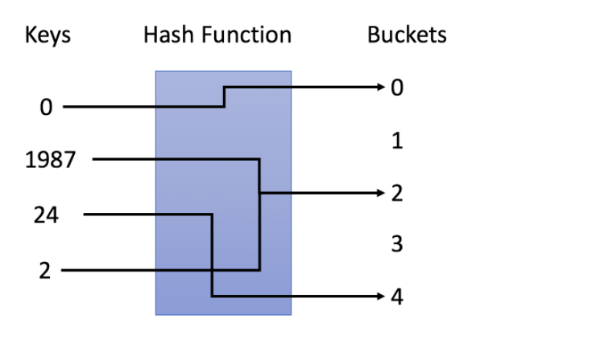

# 哈希表

哈希表是一种数据结构，它使用哈希函数组织数据，以支持快速插入和搜索。

## 哈希表的原理

**哈希表的关键思想是使用哈希函数将键映射到存储桶。**

1. 当我们插入一个键(keys)时, 哈希函数（hash function）将决定该键分配到哪个桶（Buckets）中。
2. 当我们需要搜索一个建(keys)时，哈希表将使用相同的哈希函数（hash function）查找对应的桶，并在特定的桶中搜索。



上图中，使用的是 `y = x ％ 5` 作为 hash 函数，进行值的插入和搜索。

## 哈希表的关键

### 1 哈希函数

哈希表用于将键映射到特定的桶。上图中使用的是 `y = x % 5` 作为散列函数，其中 `x` 是键值，`y` 是分配的桶的索引。

哈希函数的设计是一个开放的问题。其**思想是尽可能将键分配到桶中**，理想情况下，完美的哈希函数将是键和桶之间的一对一映射。然而，在大多数情况下，哈希函数并不完美，它需要在桶的数量和桶的容量之间进行权衡。

### 2 冲突解决

理想情况下，如果我们的哈希函数是完美的一对一映射，我们将不需要处理冲突。不幸的是，在大多数情况下，冲突几乎是不可避免的。例如，在我们之前的哈希函数（y = x ％ 5）中，1987 和 2 都分配给了桶 2，这是一个冲突。

冲突解决算法应该解决以下几个问题：

1. 如何组织在同一个桶中的值？
1. 如果为同一个桶分配了太多的值，该怎么办？
1. 如何在特定的桶中搜索目标值？

根据我们的哈希函数，这些问题与`桶的容量`和可能映射到`同一个桶`的`键的数目`有关。

让我们假设存储最大键数的桶有 `N` 个键。

- **如果 N 是常数且很小，我们可以简单地使用一个数组将键存储在同一个桶中。**
- **如果 N 是可变的或很大，我们可能需要使用`高度平衡的二叉树`来代替。**

## 训练

解题：`阅读需求`，确定`哈希函数`并在需要时`解决冲突`。
基本操作：`插入`和`搜索`，如果要`删除元素`，可以先搜索再移除。

### 设计哈希集合（使用数组 (不建议)）

```js
/**
 * Initialize your data structure here.
 */
var MyHashSet = function() {
  this.data = [];
};

/**
 * @param {number} key
 * @return {void}
 */
MyHashSet.prototype.add = function(key) {
  let index = this.data.indexOf(key);
  if (index === -1) {
    this.data.push(key);
  }
};

/**
 * @param {number} key
 * @return {void}
 */
MyHashSet.prototype.remove = function(key) {
  const index = this.data.indexOf(key);
  if (index > -1) {
    this.data.splice(index, 1);
  }
};
/**
 * Returns true if this set contains the specified element
 * @param {number} key
 * @return {boolean}
 */
MyHashSet.prototype.contains = function(key) {
  return this.data.indexOf(key) > -1;
};

/**
 * Your MyHashSet object will be instantiated and called as such:
 * var obj = new MyHashSet()
 * obj.add(key)
 * obj.remove(key)
 * var param_3 = obj.contains(key)
 */
```

### 设计哈希集合（使用对象 (建议)）

```js
/**
 * Initialize your data structure here.
 */
var MyHashSet = function() {
  this.data = {};
};

/**
 * @param {number} key
 * @return {void}
 */
MyHashSet.prototype.add = function(key) {
  !this.data[key] && (this.data[key] = true);
};

/**
 * @param {number} key
 * @return {void}
 */
MyHashSet.prototype.remove = function(key) {
  this.data[key] && delete this.data[key];
};
/**
 * Returns true if this set contains the specified element
 * @param {number} key
 * @return {boolean}
 */
MyHashSet.prototype.contains = function(key) {
  return !!this.data[key];
};

/**
 * Your MyHashSet object will be instantiated and called as such:
 * var obj = new MyHashSet()
 * obj.add(key)
 * obj.remove(key)
 * var param_3 = obj.contains(key)
 */
```
